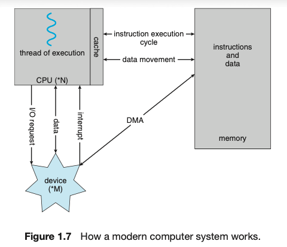
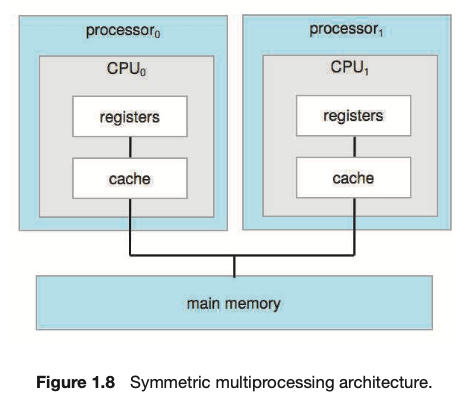
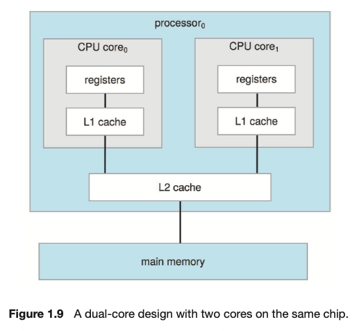
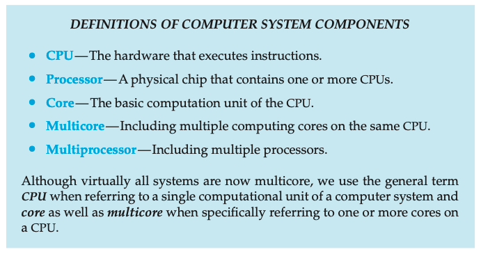
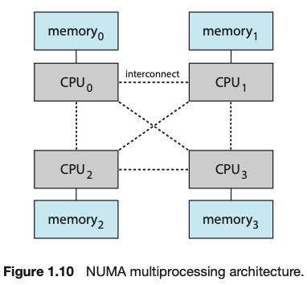
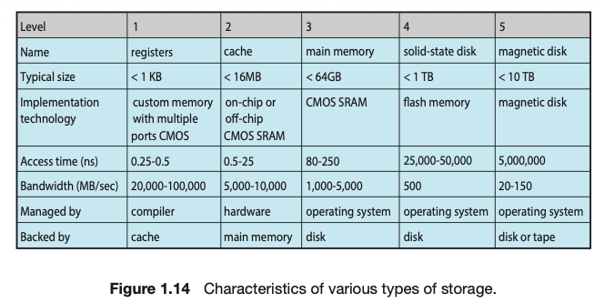

# Introduction    
OS manages Computer hardware and provides an interface for the applications to use the underlying hardware 

4 components of modern computer system - hardware (includes the CPU, memory, IO devices), applications programs (anything), the operating system and the user

// Abstract view of the components of a computer system

OS is one program running at all times on the computer - usually called the kernel. Along with the kernel there are 2 other types of programs - system programs which are associated with the OS but not necessarily part of the kernel and the application programs which include all programs not associated with the OS.

# Computer-System Organization

Device Controller - in charge of a specific type of device - disk drive, audio device, etc - more than one device can be attached. Maintains local buffer storage and a set of special-purpose registers - responsible for moving data between peripheral devices it controls and the local buffer storage

Device driver - OS has each for a controller - understands the controller and provides a uniform interface to the device.

Memory controller - device controllers and the CPU can execute in parallel compeeting for memory cycles and memory controller syncs access to memory.   

## Interrupts

To perform an IO operation:- 
1. Device driver loads the appropriate register in the device controller
2. Device controller examines the contents of the registers to see what action to perform
3. Controller starts the transfer of data from the device to its local buffer
4. Controller informs the driver it has compelted the transfer - via an INTERRUPT.
5. Driver gives the control to other parts of the OS

Overview - 
Hardware can trigger an interrupt at any time by sending a signal to the CPU via the system bus
When CPU is interrupted - it stops doing whatever and transfers execution to a fixed location - the location of the starting address where the service routine for the interrupt is located. The interrupt routine executes, on completion the paused computation is continued.

IMP - interrupt must transfer controller to specific interrupt routine. To do this:
A table of pointers to interrupt routines are stored in low memory - first 100 or so locations holding the address of the interrupt service routines for various devices - called as Interupt vector is indexed by a unique number to provide address of interrupt service routine for the interrrupt request.
Must also save the state of the whatver is interrupted - eg if tge interrupt needs to update the processor state by modifying register values, it must save the state and restore it before beginning. After the interrupt is serviced, the return adderess is loaded into the program counter and resumes computation.

### Implementation

CPU Hardware has a Interrupt request line - sensed by the CPU after every executing every insttruction - if it detects an interrupt - jumps to the interrupt handler routine, does the instruction and execute return_from_interrupt.

However , we need more sophisticated Interrupt handling

Most CPUs have 2 request lines - 
1. Nonmaskable - reserved for events as unrecoverable memory errors
2. Maskable - can be turned of the CPU before execution of cristical instruction sequences that must not be interrrupted - it is used by the device controllers

Interrupt chaining - each element in the interrupt vector points to the head of teh list of interrupt handlers - when interrupt raised all handlers are called one by one until one is found. This is a compormise between a huge interrupt tables and inefficiency of dispatching to a single interrupt handler.

Events 0 to 31 are nonmaskable used to signal various error conditions, 32 to 255 are maskable used for device generated interrupts

Interrupt Priority levels - used to defer low priority inteerrupts for higher priority

## Storage Structure

CPU can load instructions only from memory, so any program must first be loaded into memory to run. Computers run most of their programs from rewirteable RAM. Main memory is implemented in DRAM.

When you turn on the computer - a bootstrap program is run which loads the operating system, RAM is volatile and loses its contents when the computer is shut off so this bootstrap program loaded from Electrically erasable programmanle read only memory EEPROM and other forms of firmwar - which is infrequently written and is nonvolatile. EEPROM can be changed but not frequently, is low speed and contains mostly static programs and data that arent frequently used.   

load instruction - move byte or a word from main memory to internal register of the CPU
store instrcution - move the contents of register to main memory
Aside from explicit loads and stores, CPU automatically loads instructions from main memory for execution from the location stored in teh program counter.

Typical instruction - execution style in Von Neumann architecture
1. Fetch instruction from memory and store the instruction in the instruction register.
2. Instruction is then decoded and may cause operands to be fetched from memory and stored in some internal register.
3. After the instruction is performed on teh operands, the data may be stored in the memory.
4. Memory unit only sees a stream of memory addresses and not how they are generated

Ideally we want all program data in main memory - which is RAM but this is not possible because :- 
1. Main memory is volatile
2. Main memory is too small

So, computers provide Secondary storage - in the form of HDDs and NVM (Non volatile memory) devices. Most programs are stored in teh secondary storage unless loaded into memory. 

Tradeoff between size and speed - smaller and faster memory closer to the CPU

Top 4 levels are semi conductor memory consisting of semi condutcor based electronic circuits.

**IMPORTANT CLARIFICATIONS FOR ALL CHAPTERS GOING FORWARD:-** 
1. memory stands for volatile memory - like RAM, register, etc
2. NVS - HDDs, SSD, etc

## IO Structure

For bulk data movement such as NVS I/O :- 
1. Direct memory access DMA is used
2. Controller sets up the pointers, buffers, counters and transfers an entire block of data direclty to or from device and main memory wihtout any intervention from the CPU via the interrrupt mechanism
3. Only 1 interrupt is generated to tell the device driver that operation is completed

# Computer System Architecture

## Single-Processor Systems

Before most computer systems used a single processor with one CPU with a single core.
Core - CPU componetnt that executes instructions and registers for storing data locally. 
The one main CPU is reponsible for executing the general purpose instrucition set including the instrcutions from processes.
These systems are capable of executing a general purpose instruction set, and can have device specific processors such as disk keyboard, and graphics controller

Basically the existence of these specific microprocessors that may or may not take instructions from the OS does not make these systems multicore as they have only 1 general purspose core.

## Multicore systems

Traditionally, two or more processors each with single core CPU - they share the computer bus, clock, memory and peripeheral devices.
- Increased throughput - expect more work done in less time but overhead occurs when keeping all parts working correctly plus contention for share resources

Most commonn multicore systems use Symmetric Multiprocessing (SMP) - each peer CPU processor performs all tasks including OS functions and user processes. 

Each CPU processor has its own set of registers, cache. All processors share physical memory over the system bus.
- can run N processes
- but is possible that one processor gets overloaded.

Now multicore means multiple core residing on a single chip - they are more efficient as on-chip communication is faster than between chip communication.
They also use singnificantly less power than the counterparts.

Each core has its own local cache - L1
L2 is local to the chip but shared by the 2 cores

Adding more CPUs we run into the system bus bottleneck.
Alternative approach - provice each CPU or group of CPUS with its own local memory that is accessed via a small, fast bus. The CPUs are connected by a **shared system interconnect**, so that all CPUs share the same address space. This is NUMA (Non-uniform memory access). Advantage is when CPU accesses local memory it is fast and no contention over the system interconnect.
**NUMA systems scale more effectively as more processors are added**

Drawback - increased latency for remote memory access like CPU0 try to access CPU3 memeory. This can be minimied by careful CPU scheduling and memory management.

**Blade servers** - multiple processors boards, I/O boards and networking boards placed in the same chassis - difference vs multicore is each board boots up with its own OS.

## Clustered Systems

Loosely coupled - composed of 2 individual systems - mostly connected via LAN or faster interconnect like InfiniBand

This section is all about 
1. Fault Tolerance, 
2. Graceful Degradation, 
3. Asymmetric Clustering (using a hot standby monitoring main), 
4. Symmetric Clustering( 2nodes monitoring each other), 
5. Redundancy, 
6. Parallelization (dividing the program into separate components that run in parallel on individual cores in a computer or a cluster of computers)
7. Storage Area Networks - support thousands of systems in a cluster over a wide area
8. Distributed Lock manager (DLM) - provide shared access control to a database and locking to ensure no conflicting operations occur.

# Operating System Operations

 Bootstrap program initializes all aspects of system from CPU registers to device controllers to memory contents, locates the kernel and loads it into memory.

After kernel is loaded, starts providing services to system and users
System Daemons - services provided outside of the kernel like "systemd" in linunx that starts many other daemons.

Trap - software generated interrupt caused either by an error or by a specific request from a user program that an OS service be performed by executing a special operation called a **system call**.

## Multiprogramming and Multitasking

Multiprogramming increases CPU utilisation by organizing programs so that CPU always has pne to execute - here a program execution is termed a process.

Multitasking - logical extesnion of multi programming - executes multiple CPU processes simultaneously by switching among them but the switches occur frequentlt providing the user a fast response time - this is **CPU Scheduling**

**Virtual Memory** - techinique that allows execution of a process that is not completely in memory - allowing users to run programs that are larger than physical memory - it abstracts main memory into large uniform array of storage separating logical memory as viewed by the user from physical memory.

## Dual Mode and Multimode Operation

1. User mode
2. Kernel mode (supervisor mode, system mode, privileged mode) - done via **mode** bit added to hardware of the computer to indicate current mode

Boot time - hardware starts in kernel mode --> OS is loaded and starts user applications in user mode --> if trap or interrrupt occurs the harware switches from user to kernel mode --> switches back to user mode before passing control to the user program

System call - means for user program to ask the OS to perform privileged tasks - usually takes the form of a trap or a specific syscall instruction.

When a syscall is executed:
1. treated by hardware as an interrupt
2. Control passes through the interrrupt vector to a service routine in the OS.
3. Mode bit is set to kernel mode
4. Kernel identifies the interrupting instruction to see which syscall has occured - a parameter indicates what type of service the user program is requesting
5. Kernel verifies parameters are correct and legal 
6. Executes the request
7. Passes control back to the instruction follow the syscall

## Timer

Purpose: The OS must maintain control over the CPU - cannot allow a program to get stuck in an infinite loop and never return control.
Way: Timer can be set to interrrupt after specified period
**Variable Timer** - Implemented by a fixed rate clock and a counter - everytime clock ticks counter is decreased - when it reaches 0 - interrupt occurs

# Resource Management

## Process Management

A process needs certain resources—including CPUtime, memory, files, and I/O devices—to accomplish its task

IMP: A program by itself is not a process. A program is a passive entiity like contents of a file stored on the disk whereas a process is an active entity. A single threaded process has one program counter - specifying next instructions to execute. The execution of such process must be sequential - instructions one after the other till the process completes. A multithreaaded process has multiple porgram counters each pointing to the next instrucion to execute.

A process is a unit of work in a system. System consists of colloection of processes swome of which are OS processes and rest are OS processes.

OS is responsible for the following activities in connnection with process management :- 
1. Creating and deleting both user and system processes
2. Scheduling processes and threads on the CPUs
3. Suspending and resuming processes
4. Providing mechanisms for process synchronization
5. Providing mechanizsms for process communication

## Memory Management

Main memory (RAM) is a repository of quickly accessible data shared by the CPU and the IO Devices. CPU reads instrcutions from main memory and writes to main memory too - it is the only large storage device that is accessible to CPU directly

For a program to be executed it must be mapped to absolute address and loaded into memory. As the program executes program instructions are read from the memory by generating these absolute addresses. Eventually, the program terminates its memory space is declared available and the next program can be loaded and executed

OS is responsible for the following activities in connection with memory management:- 
1. Keeping track of which parts of memory are currently being used and whihc process is using them
2. Allocating and Deallocating memory space as needed
3. Deciding which processes (or parts of processes) and data move into and out of the memory.

## Cache Management

Data copied from memory to faster storage system - Cache - managed by the hardware.

Some caches are implemented totally in hardware - most systems have instruction cache to hold whihc instrcutions to be executed next - they are out of control of the OS

Cache Coherency - data stored in multiple places like disk, memory, cache and registers can go out of sync when updated or read
