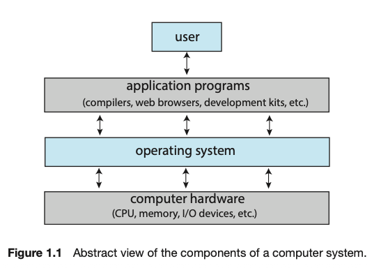
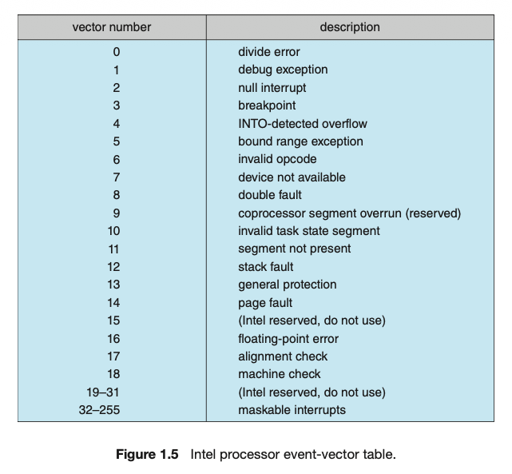
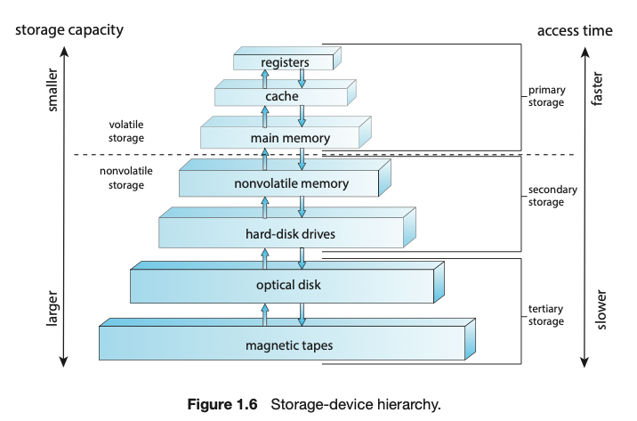

# Introduction    
OS manages Computer hardware and provides an interface for the applications to use the underlying hardware 

4 components of modern computer system - hardware (includes the CPU, memory, IO devices), applications programs (anything), the operating system and the user

// Abstract view of the components of a computer system

OS is one program running at all times on the computer - usually called the kernel. Along with the kernel there are 2 other types of programs - system programs which are associated with the OS but not necessarily part of the kernel and the application programs which include all programs not associated with the OS.

# Computer-System Organization

Device Controller - in charge of a specific type of device - disk drive, audio device, etc - more than one device can be attached. Maintains local buffer storage and a set of special-purpose registers - responsible for moving data between peripheral devices it controls and the local buffer storage

Device driver - OS has each for a controller - understands the controller and provides a uniform interface to the device.

Memory controller - device controllers and the CPU can execute in parallel compeeting for memory cycles and memory controller syncs access to memory.   

## Interrupts

To perform an IO operation:- 
1. Device driver loads the appropriate register in the device controller
2. Device controller examines the contents of the registers to see what action to perform
3. Controller starts the transfer of data from the device to its local buffer
4. Controller informs the driver it has compelted the transfer - via an INTERRUPT.
5. Driver gives the control to other parts of the OS

Overview - 
Hardware can trigger an interrupt at any time by sending a signal to the CPU via the system bus
When CPU is interrupted - it stops doing whatever and transfers execution to a fixed location - the location of the starting address where the service routine for the interrupt is located. The interrupt routine executes, on completion the paused computation is continued.

IMP - interrupt must transfer controller to specific interrupt routine. To do this:
A table of pointers to interrupt routines are stored in low memory - first 100 or so locations holding the address of the interrupt service routines for various devices - called as Interupt vector is indexed by a unique number to provide address of interrupt service routine for the interrrupt request.
Must also save the state of the whatver is interrupted - eg if tge interrupt needs to update the processor state by modifying register values, it must save the state and restore it before beginning. After the interrupt is serviced, the return adderess is loaded into the program counter and resumes computation.

### Implementation

CPU Hardware has a Interrupt request line - sensed by the CPU after every executing every insttruction - if it detects an interrupt - jumps to the interrupt handler routine, does the instruction and execute return_from_interrupt.

However , we need more sophisticated Interrupt handling

Most CPUs have 2 request lines - 
1. Nonmaskable - reserved for events as unrecoverable memory errors
2. Maskable - can be turned of the CPU before execution of cristical instruction sequences that must not be interrrupted - it is used by the device controllers

Interrupt chaining - each element in the interrupt vector points to the head of teh list of interrupt handlers - when interrupt raised all handlers are called one by one until one is found. This is a compormise between a huge interrupt tables and inefficiency of dispatching to a single interrupt handler.

Events 0 to 31 are nonmaskable used to signal various error conditions, 32 to 255 are maskable used for device generated interrupts

Interrupt Priority levels - used to defer low priority inteerrupts for higher priority

## Storage Structure

CPU can load instructions only from memory, so any program must first be loaded into memory to run. Computers run most of their programs from rewirteable RAM. Main memory is implemented in DRAM.

When you turn on the computer - a bootstrap program is run which loads the operating system, RAM is volatile and loses its contents when the computer is shut off so this bootstrap program loaded from Electrically erasable programmanle read only memory EEPROM and other forms of firmwar - which is infrequently written and is nonvolatile. EEPROM can be changed but not frequently, is low speed and contains mostly static programs and data that arent frequently used.   

load instruction - move byte or a word from main memory to internal register of the CPU
store instrcution - move the contents of register to main memory
Aside from explicit loads and stores, CPU automatically loads instructions from main memory for execution from the location stored in teh program counter.

Typical instruction - execution style in Von Neumann architecture
1. Fetch instruction from memory and store the instruction in the instruction register.
2. Instruction is then decoded and may cause operands to be fetched from memory and stored in some internal register.
3. After the instruction is performed on teh operands, the data may be stored in the memory.
4. Memory unit only sees a stream of memory addresses and not how they are generated

Ideally we want all program data in main memory - which is RAM but this is not possible because :- 
1. Main memory is volatile
2. Main memory is too small

So, computers provide Secondary storage - in the form of HDDs and NVM (Non volatile memory) devices. Most programs are stored in teh secondary storage unless loaded into memory. 

Tradeoff between size and speed - smaller and faster memory closer to the CPU

Top 4 levels are semi conductor memory consisting of semi condutcor based electronic circuits.

IMPORTANT CLARIFICATIONS FOR ALL CHAPTERS GOING FORWARD:- 
1. memory stands for volatile memory - like RAM, register, etc
2. NVS - HDDs, SSD, etc

## IO Structure

For bulk data movement such as NVS I/O :- 
1. Direct memory access DMA is used
2. Controller sets up the pointers, buffers, counters and transfers an entire block of data direclty to or from device and main memory wihtout any intervention from the CPU via the interrrupt mechanism
3. Only 1 interrupt is generated to tell the device driver that operation is completed

# Computer System Architecture

