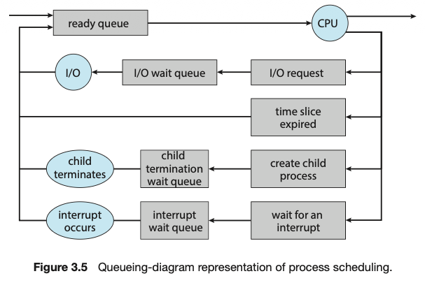
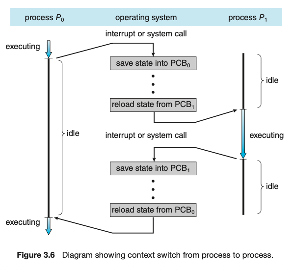
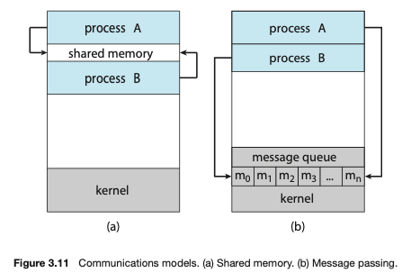

# Processes
- A program in execution, needs certain resources such as CPU time, memory, files, and I/O devices to accomplish its tasks

## Process Concept

Status of current activity of a process is represented by the value of the **program counter** and the contents of teh processsor's registers.

Text section - executable code - fixed size  
Data section - global variables- fixed size
Heap section - memory that is dynamically allocated during program runtime
Stack section - temp data storage when invoking functions( params, return addresses and local variables) - called as **Activation Record**

Stack and Heap grow toward one another but must never overlap

Program becomes a process when an executable file is loaded in memory 

## Process State

Current activity of the process. 5 states
1. New - process is being created
2. Running - Instructions are being executed
3. Waiting - Process is waiting for some event to occur
4. Ready - Process is waiting to be assigned to a processor
5. Terminated - Process has finished execution

IMP - Only one process can be running on any processor core at any instant. Many processes can be ready and waiting.

## Process Control Block
- also called a task control block

Process State - may be new, ready, running, waiting, halted and so on.
Program counter - indicates the address of the next instruction to be executed for this process.
CPU registers - include accumulators, index registers, stack pointers, and general purpose registers, plus any condition code information. Along with the program counter, this state information must be saved when an interrupt occursto allow the process to be continued correctly afterward when it is rescheduled to run.
CPU Scheduling information - process priority, pointers to scheduling queues and other scheduling params
Memory-management information - value of the base and limit registers and the page tables, or the segment tables depending on the memory system used by the operating system.
Accounting info - amount of CPU and real time used, time limits, account numbers, job or process numbers and so on.
I/O status info - list of I/O devices allocated to the process, a list of open files and so on.

## Threads

Process is a program that performs a single thread of execution - when a process is running a single thread of instructions in being executed - thus performing only 1 task at a time.
Modern OS have extended processes to have multiple threads of executions and perform more tasks at a time. Systems that support threads the PCB is expanded to include information for each thread.

# Process Scheduling

Have some process running at all times to maximize CPU utilization. 
Time Sharing is to switch a CPU core among processes so frequently that users can interact with each program while it is running
Process Scheduler selects an available process for program execution on a core. Each core can run one process at a time. Excess processes will have to wait until a core is free and can be rescheduled. The number of processes in memory is called degree of multiprogramming.

I/O bound processes - spends more of its time doing I/O
CPU-bound processes - generates I/O requests infrequently using more of its time doing computations.

## Scheduling queues

Ready Queue - stored as a linked list; ready-queue header contains pointer to the first PCB in the list, each PCB includes a pointer field that points to the next PCB in the list.

CPU Scheduler - executes atleast every 100 milliseconds as it has to keep removing the process from the CPU.
Swapping - removing a process from contention for CPU by moving it to the disk - necessary when memory is overcommitted

## Context Switch

When interrupt occurs the system needs to save the current context of the process running on the CPU core so that it can restore that context when it resumes - represented in the PCB of the process.
Pure overhead as the system does not do anything in this duration

# Interprocess Communication
- Information Sharing - several apps interested in same piece of info
- Computation Speedup - breaking a task into subtasks, each running in parallel - can only be done on a multicore cpu
- Modularity - dividing system functions into separate processes or threads

2 models:- 
1. Shared memory - region of memory shared by processes, exchange info my reading and writing data to the shared memory
   - faster than message passing since done using syscalls
   - syscalls only required to establish shared memory regions, all other are routine memory accesses not syscalls
2. Message Passing - done via means of messages 
    - useful for exchanging small amount of data
    - easier to implement

## IPC in Shared Memoery Systems

The shared-memory region resides inside the process's address space - other process attach this to them - both must agree to do this - they are responsible for ensuring they are not writing to the same location simultaneously.

2 types of buffers can be used for writing
- unbounded - consumer might have to wait but the producer can always produce new items
- bounded - consumer must wait if buffer is empty and producer must wait if buffer is full

## IPC In Message-Passing Systems

synchronize without sharing address space - distributed environments
communication link - send and recieve messages over a channel

### Naming
Direct communication - send messages using the names of the processes
Indirect communication - send messages using using mailboxes or ports

### Synchronization
Message passing can be blocking (sychronous) or non-blocking(asynchronous)

Blocking send - sending process is blocked until a message is recieved by the receving process or the mailbox
Nonblocking send - sends message and resumes operation
Blocking receive - Receiver blocks until a message is available
Nonblocking receive - Receiver receives either a valid value or null

Buffering

Queues types
1. Zero cpacity - link cannot have any messages waiting, sender must block until the receiver recives
2. Bounded capacity - finite length n; at most n messages can reside, sender must block
3. Unbounded capacity - queue length is potentially infinite, sender never blocks

# Communication in Client Server Systems

## Sockets

Endpoint for communication - each process communicating over a network gets its own socket - IP address followed by a port
Steps:
1. Server waits for incoming requests on a port
2. Server accepts the connection from the client to complete connection
3. Client that initiates a connection request is assigned a port - greater than 1024
4. Java Sockets: Connection-oriented(TCP) - Sockets class, Connectionless(UDP) - DatagramSocket class and MulticastSocket class - subclass of DatagramSocket; allows data to be sent to multiple recepients
5. The server sends the data over the socket
6. Clients dont have to accept connections - they can just send the data to teh server port but servers have to accept connections first

## Remote Procedure Calls

Designed to abstract the procedure-call mechanism for use between systems and network connections
use a message based communication to enables remote service

In contrast with IPC messages, RPC messages are well structured and no longer just packets of data - each message addressed to a RPC daemon listening to a port on the remote system containing an identifier function to execute and params to pass to that function. The function is then executed as requested and any output is sent back to the requester in a separate message.

Ports in this provide a way for clients to execute set functions on different prots by sending requests to corresponding ports.
