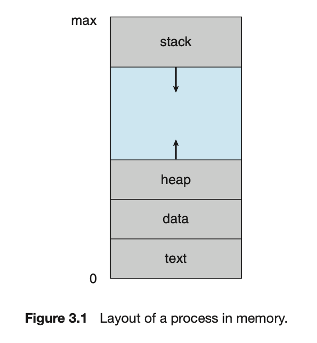
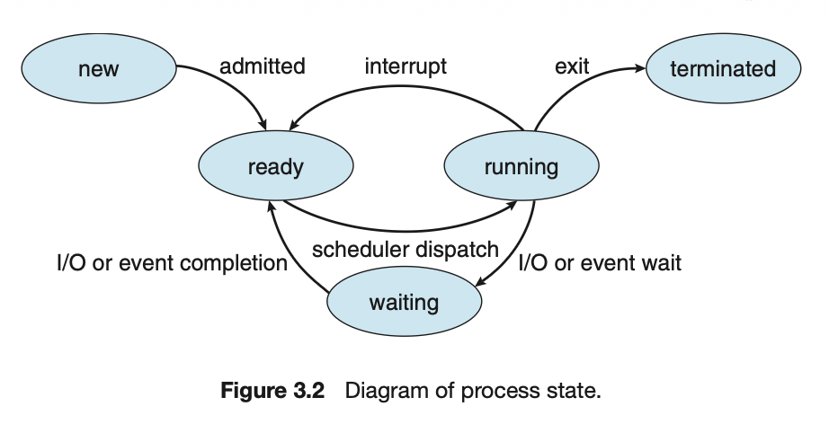
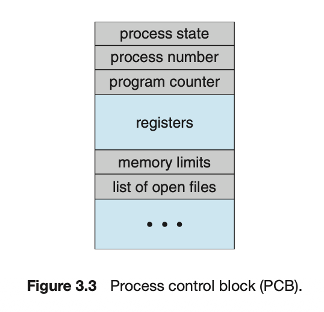

# Processes
- A program in execution, needs certain resources such as CPU time, memory, files, and I/O devices to accomplish its tasks

## Process Concept

Status of current activity of a process is represented by the value of the **program counter** and the contents of teh processsor's registers.

Text section - executable code - fixed size  
Data section - global variables- fixed size
Heap section - memory that is dynamically allocated during program runtime
Stack section - temp data storage when invoking functions( params, return addresses and local variables) - called as **Activation Record**

Stack and Heap grow toward one another but must never overlap

Program becomes a process when an executable file is loaded in memory 

## Process State

Current activity of the process. 5 states
1. New - process is being created
2. Running - Instructions are being executed
3. Waiting - Process is waiting for some event to occur
4. Ready - Process is waiting to be assigned to a processor
5. Terminated - Process has finished execution

IMP - Only one process can be running on any processor core at any instant. Many processes can be ready and waiting.

## Process Control Block
- also called a task control block

Process State - may be new, ready, running, waiting, halted and so on.
Program counter - indicates the address of the next instruction to be executed for this process.
CPU registers - include accumulators, index registers, stack pointers, and general purpose registers, plus any condition code information. Along with the program counter, this state information must be saved when an interrupt occursto allow the process to be continued correctly afterward when it is rescheduled to run.
CPU Scheduling information - process priority, pointers to scheduling queues and other scheduling params
Memory-management information - value of the base and limit registers and the page tables, or the segment tables depending on the memory system used by the operating system.
Accounting info - amount of CPU and real time used, time limits, account numbers, job or process numbers and so on.
I/O status info - list of I/O devices allocated to the process, a list of open files and so on.

## Threads

Process is a program that performs a single thread of execution - when a process is running a single thread of instructions in being executed - thus performing only 1 task at a time.
Modern OS have extended processes to have multiple threads of executions and perform more tasks at a time. Systems that support threads the PCB is expanded to include information for each thread.

# Process Scheduling

Have some process running at all times to maximize CPU utilization. 
Time Sharing is to switch a CPU core among processes so frequently that users can interact with each program while it is running
Process Scheduler selects an available process for program execution on a core. Each core can run one process at a time. Excess processes will have to wait until a core is free and can be rescheduled. The number of processes in memory is called degree of multiprogramming.

I/O bound processes - spends more of its time doing I/O
CPU-bound processes - generates I/O requests infrequently using more of its time doing computations.

## Scheduling queues

