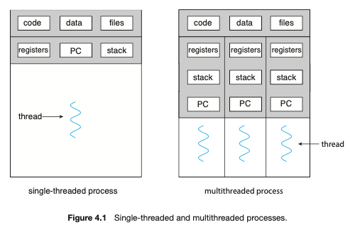
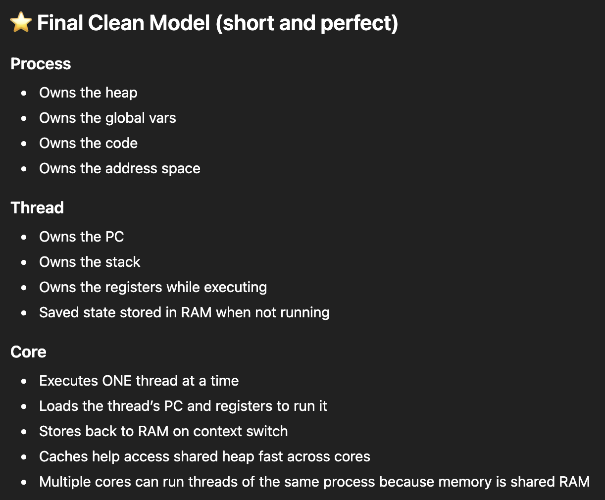

# Threads and Concurrency

## Overview

Thread is a basic unit of CPU utilization; comprises of a threadID, a program counter (PC), a register set, and a stack. It shares with other threads belonging to the same process its code section, data section, and other OS resources such as open files and signals. Traditional process has a single thread of control. If a process has multiple threads, it can perform more than one task at a time.

Threads help us when the same process is requested a number of times - so instead of creating another process which is time and resource consuming - we can create a separate thread for the process - IMP - still only 1 thread is executing at a time since the CPU hardware in a single core can only execute one instruction at a time.
Benefits:
1. Responsiveness - may allow a program to continue running even if part of it is blocked or is performing a lengthy operation increasing responsiveness eg. in UI single threaded application would be unresponsvive till the initial process is over.
2. Resource Sharing - Processes can share resource only through shared memory and message passing - has to be explicitly arranged by the programmer. **Threads share memory and resources of the enclosing process**
3. Economy - Allocating memory and reources for process creation is costly. Threads are more economical to create and context-switch(faster too).
4. Scalability - Benefits of mutlithreading are even moer in multiprocessro architecture - where many threads run in parallel on different cores.

# Multicore Programming

System with single core - threads will be interleaved over time as processing core is capable of executing only one thread at a time    
System with multiple cores - threads can run in parallel as system can assign a thread to a diff core

Concurrency - system supports more than one tasks by allowing all tasks to make progress (threads in a single core CPU)
Parallelism - system can perform multiple tasks at once (threads in a multicore CPU)
**So, Possible to have Concurrency without Parallelism** - earlier CPU were designed to rapidly switch between processes giving the illusion of Parallelism but it was Concurrency.

## Programming Challenges
1. Identifying tasks - divide application to separate concurrent tasks - that are independent of one another so that they can run in parallel on individual cores
2. Balance - tasks(threads) perform equal work of equeal value - otherwise may not be worth the cost
3. Data splitting - data accessed and manipulated by tasks must be divided to run on separate cores
4. Data dependency - data must be examined for dependencies between 2 or more tasks - if present the execution of task must be synchronized.
5. Testing and debugging - when in parallel on multi cores - many execution paths are possible - testing and debugging is more difficult

## Types of Parallelism
1. Data Parallelism - Focuses on distributing subsets of same data acrosss multiple cores and performing the same operation on each core - summing upto n example - 1 ... N on 1 core vs 1 ... N/2 on core1 + N/2+1 ... N core2.
2. Task Parallelism - Distributing tasks (not data) over multiple cores - each thread performing a unique operation.

# Mutithreading

2 levels of support for threads
1. user threads - managed wihtout kernel support above the kernel
2. kernel threads - supported and managed directly by the OS
Relationships between user threads and kernel threads

## Many-to-One Model
Many user level threads mapped to a kernel thread - thread management is done by the thread library in the user space(efficient). But the entire process will block if a thread(user space) makes a blocking system call. **Also, because only one thread can access the kernel at a time, multiple threads are unable to run in parallel on multicore systems**. eg - **Green threads** - a thread library in earlier version of Java

## One-to-One Model
Each user thread mapped to each kernel thread - provides more concurrency by allowing another thread(kernel space) when a thread(user space) make a blocking system call. Allows multiple threads to run in parallel on multiprocessors. **Creating a large number of user threads will create a large number of kernel threads which can burden the CPU**. eg - Linux and Windows

## Many-to-Many Model
Many user-level threads to smaller or equal number of kernel threads - no of kernel threads can be specific to application or the machine - **does not suffer from any previous drawbacks** - Users can make as many user threads, corresponding kernel threads can run in parallel on a multiprocessor - even if a thread performs a blocking call, the kernel can schedule another thread for execution.
This is difficult to implement - also as number of cores keep increasing more OS now use the one-to-one model **Some contemporary concurrency libraries have developer identify tasks that are then mapped to threads using a many-to-many model.

# Thread Libraries

2 types:
1. User level library - all code and DS in user space, local function call and not a function call
2. Kernel level library - code and US in kernel space, invoking function results in a system call

Asynchronous threading - Once parent creates a child, the parent resumes its execution, so that the parent and the child execute concurrently and independently of one another, typically little data sharing between them - strategy used in multithreaded server used for designing responsive UIs.
Synchronous threading - parent creates one or more threads and now has to wait for all of its children to terminate before it resumes. Threads created by the parent work concurrently but the parent cannot continue  - only after all children have terminated can the parent resume - involves significant data sharing - parent thread may combine results calculated by its various children.

# Implicit threading

Transfer the creation and management of threading from application developers to compilers and run-time libraries. Developers identify tasks - not threads that can run in parallel - which the runtime library then maps to a separate thread typically using a many-to-many model

## Thread pools

Problems with on demand thread creations:-
1. Creating a new thread takes time and it is discarded when terminated
2. Continusously creating new threads can exhaust system resources like CPU time or memory.

Thread pools have a fixed number of threads at startup and place them into a pool - sitting and waiting for work. if a thread is available - it picks up the request else the task is queued until a thread frees up - once the thread completes its work, it returns to the pool
Benefits: Above mentioned drawbacks + 
3. Separating the task to be performed from the mechanics of creating the task allows us to use diff strategies for running the task - task can be scheduled to execute after a time delay or to execute periodically

## Fork Join

Parent creating a fork to spawn children strategy - sync and async

## OpenMP - Goroutines as an example

Identifies parallel regions as blocks of code that may run in parallel - developers insert compiler directives like (go) into the code at parallel regions and these directives instruct the OpenMP runtime to execute the region in parallel.\
the directive creates as many threads as there are cores in the system - dual core 2 threads are created - all threads then simultaneously execute the parallel region

# Threading issues

## The fork and exec system calls

Semantics of fork() and exec() change in multithreaded program - 2 versions of fork() - one duplicates all threads the other duplicates only the thread involved with fork() system call.

exec() system call works in the same way - the program specified in the param to exec() will replace the entire process including all threads.
If exec() is called immediately after fork() then duplicating all threads is unnecessary as the program specified in the exec() param will replace the process - duplicating only th e calling thread is appropriate.
If however the separate process does not call exec() after forking the separate process should duplicate all threads

## Signal handling

A signal is used in UNIX systems to notify a process that a particular event has occurred - can be received sysnchronously or asynchronously depending on the source of and the reason for the event being signaled
Sync singals - illegal memory accesss, division by 0 - if a program does this a signal is generated - **Sync signals are delivered to the process that performaed the operation that created the signal**
Async signals - Signal is generated to an event external to a running process - eg terminating a process externally using <Ctrl> C

Signals handled by:
1. Default signal handler - kernel runs when handling a signal
2. User-defined signal handler - can override the default

Handling signals in single threaded programs is simple - signals are always delivered to a process

Sync signals need to be delivered to the thread causing the signal and not to the other threads
Async signals are not clear - eg. <Ctrl> C should be delivered to all threads.

## Thread Cancellation

Terminating a thread before it has completed. eg - multiple threads concurrently searching through a db and one thread returns aresult then the rest should be cancelled.
Target thread - the thread that is to be cancelled

Cancellatin scenarios
1. Async Canc - One thread immediately terminates the target thread
2. Deferred Canc - Target thread periodically checks whether it should terminate, allowing it an opportunity to terminate itself in an orderly fashion.

Difficulty with cancellation occurs - resources have been allocated to a cancelled athread or where a thread is canceled while in the midst of updating data it is sharing with other threads. This is especially hard with async as OS wil reclaim system resources from a canceled thread but will not reclaim all resources - cancelling a thread may not free system-wide resources

With deferred cancellation - the cancellation occurs only after target thread has determined whehter or not it should be cancelled - it can perform this check and it can be cancelled safely

## Thread-local storage

Threads belonging to a process share its data - sometimes threads might need their own data (TLS) - eg. transaction processing system - each transcation in a separate thread - each transaction gets a unique id - to associate the thread with the unique id we can use TLS
IMP: TLS is not local variables - local variables are only visible to a single function invocation - TLS data are visible across invocations - it is required when using implicit threading
TLS data is unique to each thread

## Scheduler Activations

Communication between kernel and the thread library in cases of many to many and two-level models to allow number of kernel threads to be dynamically adjusted to ensure best performance.
Light weight process (LWP) - intermediate DS between user and kernel threads. To the user thread library - LWP appears to be a virtual processor on which the applicatio can schedule a user thread to run. Each LWP is attached to a kernel thread and they run on physical processors. If a kernel thread blocks, the LWP blocks as well and so does the user thread.
In a single core CPU - only 1 thread can run so only 1 LWP is needed
Application that is I/O intensive may require multiple LWPs to execute. Typically an LWP is required for each non blocking system call/ eg - for 5 diff file read requests - 5 LWPs are needed because all could be waiting for I/O completion in the kernel - if a process only has 4 LWPs, then fifth request must wait for one of teh LWPs to return from the kernel

Scheduler Activation - communication between user-thread library and kernel - the kernel provides an application with a set of virtual processors (LWPs) and the application can schedule user threads onto an available virtual processor - kernel must inform the app about all events - called as upcalls - handled by the upcall handler running on a virtual processor

Eg. upcall occurs when an app thread is about to block - kernel makes an upcall telling the app this thread is about to block - kernel allocates a new virtual processor to the application - app runs an upcall handler on this new virtual processor - saving the state of the blocking thread and relinquishing the virtual processor on which the blocking thread is running - upcall handler schedules another thread which is eligible to run on the new virtual processor - when the blocking event occurs the kernel makes an upcall to the app telling the event has occurerd and is now eligible to run - upcall handler for this event also requies a virtual processor and kernel mauy allocate a new virtual processor or preempt one of the user threads and run the upcall handler on its virtual processor - app marks the unblocked thread as eligible to run and schedules an eligible thread to run on an available virtual processor.
