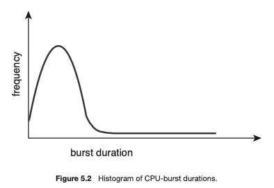

# CPU Scheduling

When one process has to wait, the OS takes the CPU away from it and gives it to another process in memory - this is an OS function

## CPU-I/O Burst Cycle

Process execution starts with a cycle of CPU execution followed by I/O wait - CPU burst and I/O burst.

CPU Burst cycle - large number of short CPU bursts and small number of long CPU bursts - I/O program has a large number of short CPU bursts while a CPU program may have a few long CPU bursts

## CPU Scheduler

Queue can be custom - not necessarily a FIFO queue can be priority, tree, etc

