# Memory Management

Memory - Large array of bytes each with its own address. CPU fetches instructions from the memeory based on PC value.
Steps:
1. PC fetches the isntruction from memory
2. The instruction is decoded and may cause operands to be fetched from memory
3. After instruction is executed on the operands - result may be stored back in the memory.
4. Memory unit sees only a stream of addresses ; does not know how they are generated or what they are for

## Basic Hardware

CPU can only access the main memory(RAM) and the registers built into each processing core. Machine instructions can take memory addresses as arguments but not disk addresses.

Registers built into each core are generally accessible within one cycle of the CPU clock. Main memory is accesses via memory bus and can take multiple cycles of the CPU clock - intolerable because of the frequency of memory access. To solve this - fast memory (cache) between the CPU and teh main memory typically on the CPU chip for fast access. Hardware automatically speeds up memory access without any OS control.

We must protect the OS from access by user processes as well as protect user processes from other user processes - provideed by hardware - because OS does not intervene between the CPU and memory accesses.
Each process gets its separate memory space - we need to determine the range of legal addreses for the process - done by using two registers - base (holds the smallest legal physcial memeory address) and limit (specifies the size of the range)
This is acomplisehed by having the CPU hardware compare every address generated in user mode with the registers. 
Base and limit registers can only be loaded witht eh special privilebed instruction - OS can change the resgieters contents but not anyonre else
The OS running in kernel mode is given unrestriced access to OS memory and users' memory. This allows the OS to load users' programs into users' memory, dump out those programs in case of errors to access and modify parameters of system calls, to perform I/O from user memory and to provide many other services. eg OS for a multi processing system must execute context switches, storing the state of one process from registers in to main memory before loading the next process's context from main memory into registers.

## Address Binding

A program resides on a disk as a binary executable file - to run it must be brough into memory and placed within the context of a process where is becomes eligible for exeecutions. When the process terminates, the memory allocated is reclaimed for use by other processes.
Most systems allow user porcess to reside in any part of the physical memoery. A user porgram goes through several steps - 
1. Addresses in the source program are generally symbolic (such as the kvariable count)
2. A compiler typically binds these symbolic addresses to relocatable addresses.
3. The linker or loader in turn binds the relocatable addresses to absolute addresses.
4. Each mapping is done from one address to another

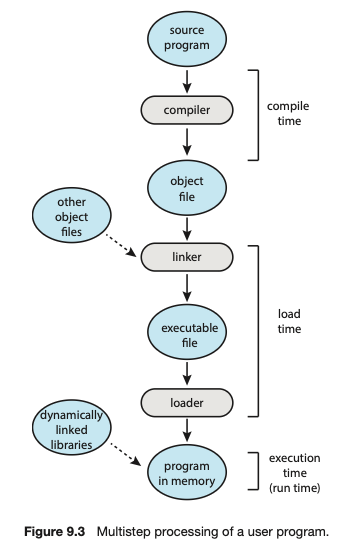

Classically the binding of instuctions and data to memeory addresses can be done at any step along the way - 
1. Compile time - If we know at compile time where hte process will reside in memory, then absolute code can be generated - the generated compiler code can start from that place and extend forward
2. Load time - If it is not known where the process will reside in memory at compile time, the compiler must generate relocatable code - final binding will be delayed until load time. If starting addresses change, we need to only reload the user code to incorporate this
3. Execution Time - if the process can be moved during its executipon from one memory segment to another, then the binding must be delayed until runtime. Special hardware is needed for this to work - most OS use this method

## Logical vs Physical Address Space

Logical address - generated by the CPU
Physical address - seen by hte memory unit, loaded into the memory address unit register of teh memory

Binding addresses at compile time or load time generates identical logical and physcial addresses. 
Execution time address binding scheme results in differing logical and physical addresses  - called as logical/virtual addresses

Runtime mapping from virtual to physical addresses in done by a hardware device called the memory management unit (MMU)

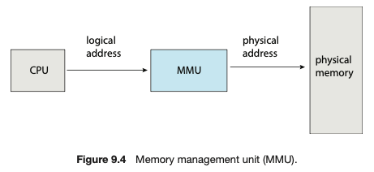

We illustrate this mapping with a simple MMU mapping scheme that is a generalization of the base register scheme - the base register is now called as relocation register - the value in teh relocation register is added to every address generated by a user process at the time the address is sent to memory.

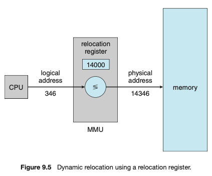

If the base is at 14000, then an attempyt the user to address location at 0 is dynamically rellcoated to location 14000; 346 to 14346 and so on.
The user program never accesses the real physical adresses. The program can create a pointer to a location 346, store it in memory, manipulate it, and compare it with other addresses. Only when it used as a memory address (in an indirect load or store perhaps) is it reloacted relative to the base register. The user program deals with logical addresses. The memory mapping hardware converts logical addresses into physical addresses. The final location of the referenced memory adrress is not determined until the reference is made.

We now have 2 diff types of addresses:- 
1. Logical addresses (range 0 to max) - the user program generates only logical addresses and thinks that the process runs in memory locations from 0 to max - these need to be mapped to physical addresses before they are used.
2. Physical addresses (range R+0 to R+max) where R is the base value

## Dynamic Loading 

To obtain better memory space utilization - a routine is not added to memory until it is called - all routines are kept on teh disk in a relocatable load format - the main program is loaded into memoery and is executed. When a routine needs to call another routine - the calling routine first checks if the other routine has been loaded  - if not the relocatbale linking loader is called to load the desired routine in memory and update the pgrams address tables to reflect this change
Dynamic loading does not require special support form the OS - it is the responsibility of the user to design their programs to take advantage of such a method - OS may help the programmer by providing library routines to implement dynamic loading.

## Dynamic Linking and Shared Libraries

DLLs are system libraries that are linked to user programs when the programs are run. SOme OS only support static linking, in which the system libraries are treated like any otehr object modules and are combined by the loader into the binary program image. Dynamic linking in contrast is like Dynamic loading - loading is postponed till execution time. Usually used with system libraries such as the standard C library, without this each porgram must include a copy of its langauge library in teh executable image - increases the size of teh executable image and wastes main memory. DLLs can be shared among multiple processes in main memory.
When a program references a DLLs the loader locates the DLL in teh main memory, loading it if necessary - it then adjusts addresses the refernece functions in tot dynamic library to teh location in memory where the DLL is stored.
DLLs can be linked to library updates - if updated all processes using DLLs will use the new updated version else each process will continue to use their own version of the librbary.
Dynamic libraries require help form the OS as only it can determine whehter processes can access each others address space.

# Contiguous Memory Allocation

Memory is divided into 2 partitions - one containing the OS and the other for the user processes. Typically the OS uses the high memory addresses. **In Contiguous Memory Allocation** each process is contained in a single section of memory that is contiguous to the section containing the next process.   

## Memory Protection

Relocation register along wiht the limit register can accomplish restricting unauthorized memory access. Logical addresses are calculated, each of which has to fall within the range thus providing protection for process memory. When teh CPU scheduler selcts a process, the dispatcher loads the relocation and the limit register with the correct values as a part of the context switch.

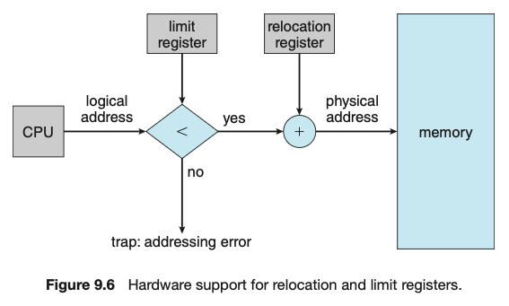

## Memory Allocation

Variable partition scheme - assigning processes to variably sized partitiions in memory where each partition may contain exactly one process. OS keeps a table indicating which parts of memory are avialable and occupied.

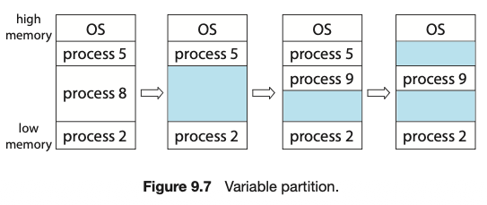

If there isn't sufficient space to satisfy incoming process :- 
1. Reject the process with appropriate error message
2. Place process into a wait queue - when memory is released, OS checks the wait queue

If the hole(variably sized partition) is too big for the incoming process, it is split into two - one for the process and the other is returned to the set of holes - if a new hole is adjeacent to other holes, they are merged to form one larger hole.

Dynamic Storage Allocation problem - satisfy a requessr of size n from a list of free holes. Strategies:- 
1. First fit - Allocate first hole that is big enough - searching can start at the beginning of teh set of where the last first fit ended
2. Best fit - Allocate the smallest hole that is big enough - search entire list - produces smallest leftover ----------
3. Worst fit - Allocate the largest hole - search entire list - prodcues the largest leftover hole which may be more useful than teh smallest leftover hole

First fit and best fit are better than worst fit in terms of decreasing time and storage utilization - tie in terms of storage utilization but first fit is faster in terms of time.

## Fragmentation

Both first fit and best fit suffer from external fragmentation - as processes are loaded and removed from memory, the free space is broken into little pieces. It exsits when there is enough total memory space to satisf a request but the availablespaces are not contiguous - storage is fragemented into a large number of small holes - severe

Statistical analysis show that for N allocated blocks, 0.5N blocks are lost to fragmentation in First Fit - one third memory is unusable - known as the fifty percent ----------

Internal Fragmentation - break the physical memory into fixed sized blocks and allocate memory in units based on block size - memory allocated to a process may be slightly highher than requested memory - unused memory that is internal to partition

Compaction - Shuffle the memory contents so as to place all free memory together in one large block. If relocation is static and is done at assembly or load time - compaction cannot be done - only possible if relocation is dynamic and is done at execution time - requires only moving the program and data and changing the base register to reflect the new base address. Simplest compaction algo is to move all processes to one end of the memory; all holes move in the other direction; creating a large hole of avialable memory - can be expensive

To avoid this, we can allow non contiguous memory allocation for logical addresses of processes - Paging - most common memory management technique.

# Paging

Permits a processes' physical address space to be non contiguous - avoids fragmentation and compaction - implemented through the cooperation between the OS and the computer hardware.

## Basic Method

Physical memory is broken down into fixed sized blocks called **frames** and breaking logical memory into blocks of the same size called **pages**. When a process is to be executed, its pages are loaded into any avialable memory frames from their source (a file system or the backing store). The backing store is divided into fixed-sized blocks that are the same size as the memory frames or clusters of multiple frames - now the logical address spaces is totally separate from the physical address space, so a process can now have a logical 64-bit address space even though the system has less than 2^^64 bytes of physical memory.

Eveery address generated by the CPU (logical address) is divided into 2 parts:-
1. page number (p)
2. page offset (d)

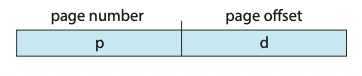

Page number is used as an index into a per-process page table

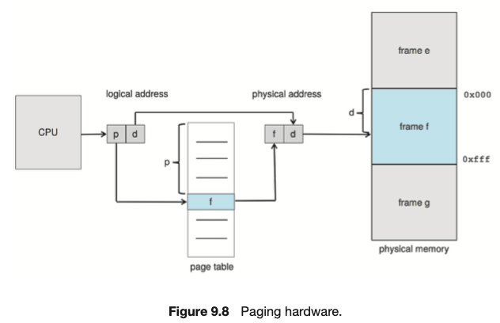

The page table contains the base address of each frame in physical memory and the offset is the location in the frame being referenced. The base address of the frame is combined with the page offset to define the physical memory address.

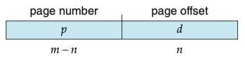

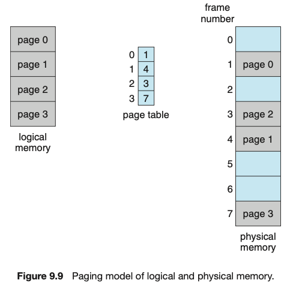

Steps to translate a logical address(generated by the CPU) to a physical address (MMU does this)
1. Extract the page number p and use it as an index into the page table
2. Extract the corresponding frame number f from the page table
3. Replace the page number in p in the logical address with the frame number.

As the offset d does not change, it is not replaced and the frame number and offset now comprise the physical address.

The page size (like the frame size) is defined by the hardware. The size of a apge is a power of 2, typically varying between 4KB and 1GB per page, depending on the computer architecture - makes translation of a logical address into a page number and page offset particularly easy. If the size of the logical address space is 2^m and a page size is 2^n  bytes, then the high-order m-n bits of a logical address designate the page number, and the n low-order bits designate the page offset. Thus, the logical address is as follows:

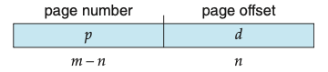

where p is an index into the page table and d is the displacement within the page.

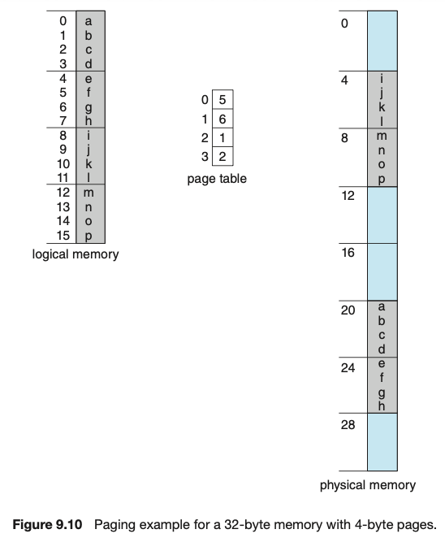

In this example, in the logical address, n = 2 and m = 4. Using a page size of 4 bytes and a physical memory of 32 bytes (8 pages), we see how the programmer's view of memory can be mapped into physical memory.
Logical address 0 is page 0, offset 0. Indexing into teh page table using the page number we find that page 0 is in frame 5. Thus, logical address maps to physical address 20=[(5x4)+0]. Logical address 3 is (page 0, offset 3) maps to physical address 23[=(5x4)+3]. Logical address 4 is page 1, offset 0; according to page table page 1 is mapped to frame 6. Thus. logical address 4 maps to physical address 24[=(6x4)+0]. Logical address 13 maps to physical address 9.
When using a paging scheme, we have no external fragmentation - any free frame can be allocated to a process that needs it. We may still have internal fragmentation though - frames are allocated as units - possible that memory requirement of a process do not happen to coincide with page boundaries, the last frame allocated might not be full. If the page size is 2048 bytes, a process of 72766 bytes will need 35 pages plus 1,086 bytes - it will be allocated 36 frames, resulkting in internal fragmentation of 2,048 bytes -1086 bytes = 968 bytes. In worst case, a process would need n pages plus 1 byte - it would be allocated n+1 frames, resulting in internal fragmentation of almost an entire frame.

 If process size is independent of page size, we expect internal fragmentation to average one-half page per process. This suggests that small page sizes are desirable. However, overhead is involved in each page table entry and this overhead is reduced as the size of teh pages increases. Also, disk I/O is more efficient when the amount of data being transferred is larger. Generally page sizes have grown over time as process, data sets and main memory have become larger. Today, page sizes are typically either 4KB or 8KB in size and some system ssupport even larger page sizes. Some CPUs and OS even support multiple page sizes. For instance, on x86-64 systems, Windows 10 supports page sizes of 4KB to 2MB. Linux also supports two page sizes, a default page size (typically 4KB) and an architecture dependent larger size called huge pages.

Frequently, on a 32-bit CPU each page table entry is 4 bytes long, but that size can vaey as well. A 32 bit entry can point to one of 2^32 physical page frames. If the frame size is 4KB (2^12) then a system with 4-byte entries in page table can address 2^44 bytes (or 16TB) of physical memory. NOTE: The size of physical memory in a paged memory system is typically different from the maximum logical size of a process. We have to store other bits of info, reducing the number of bits avaialable to address page frames.

When a process arrives in teh system to be executed - its size expressed in terms of pages is detrmeined. Each page of hthe process needs a frame. Thus if the process requires   pages, n frames must be avialble in memory. If n frames are available, they are allocated to teh arriving process. The first page of teh process is allocated to the arriving frame and the frame number is entered in the page table for this process and so on.
Programmer thinks memory in a single space, but the user program is scattered throughoutthe physical memory which also contains other programs. This mapping between the logical and physical address is controlled by the OS. The user has no way of addressing memory out of its page table and tables includes only those pages that the process owns.

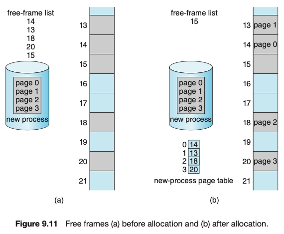

Since OS is managing the memory (frames) - it must be aware of allocation details - whihcb are allocated, whihc are free and total frames,eetc - this info is kept in a single, system wide data strucuture called a frame table. The frame table has one entry for each physical page frame indicating whether it is free or allocated and it allocated to which page of teh process (or processe).

The OS must be aware that user processes operate in user space, and all logical addresses must be mapped to produce physical addresses. If user makes a systemcall (to do I/) and provides an address as a param(a buffer for instance), that address must be mapped to produce the correct physical address. The OS table maintains a copy of the page table for each process, just as it maintains a copy of the instruction counter nad the register contents. This copy is used to translate logical addresses to physical addresses whenever the OS must map a logical address to a physical address manually. It is also used by the CPU dispatcher to define the hardware page table when a process is to be allocated the CPU. Paging therefore increases context switching time. 

## Hardware Support

Page tables are per process data structures, a pointer to the page table is stored with the other register values (like the instruction pointer) in teh process control block of each process. When a CPU Scheduler selects a process, it must reload the user registers and the appropriaate hardware page table values from the stored user page table.
Hardware implementation of page table - simplest - page table is implemented as a set of dedicated high speed hardware registers, making address translation very efficient - this increases the context switching time (process context switch) as each one of these registers must be exchnaged during a context switch.
The page table is kept in main memory and a page table base register(PTBR) points to the page table. On context switch only this register value is changed thus faster.

